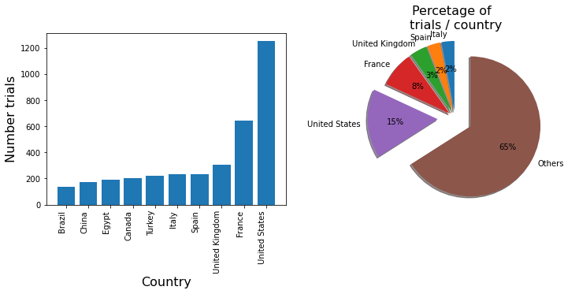
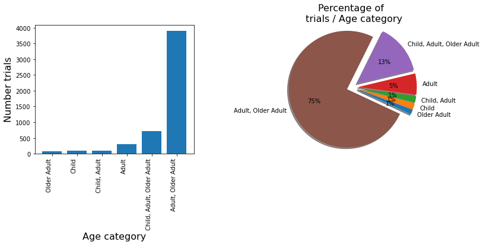
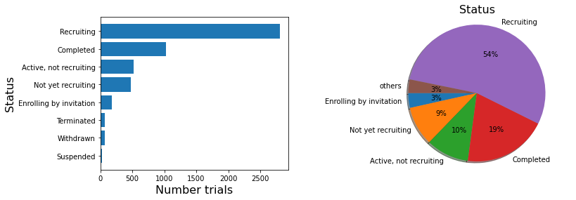
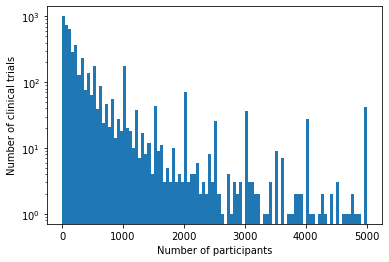

# EDA Project: COVID-19 Clinical Trials

## Project
This is a project on Exploratory Data Analysis on COVID-19 Clinical Trials using ClinicalTrials.gov dataset. 

## Dataset Description

### Origin: [Kaggle](https://www.kaggle.com/parulpandey/covid19-clinical-trials-dataset)

ClinicalTrials.gov is a database of privately and publicly funded clinical studies conducted around the world. It is maintained by the National Institute of Health. All data is publicly available and the site provides a direct download feature which makes it super easy to use relevant data for analysis.

This dataset consists of clinical trials related to COVID 19 studies presented on the site.

The dataset consists of XML files where each XML file corresponds to one study. The filename is the NCT number which a unique identifier of a study in ClinicalTrials repository. Additionally, a CSV file has also been provided, which might not have as much information as contained in the XML file, but does give sufficient information.


### Acknowledgements

ClinicalTrials.gov is a resource provided by the U.S. National Library of Medicine.

## Interventional study (clinical trial)
A type of clinical study in which participants are assigned to groups that receive one or more intervention/treatment (or no intervention) so that researchers can evaluate the effects of the interventions on biomedical or health-related outcomes. The assignments are determined by the study's protocol. Participants may receive diagnostic, therapeutic, or other types of interventions.

## Investigation of data columns


```python
import pandas as pd
import numpy as np
```


```python
clinical_trials = pd.read_csv('data/COVID clinical trials.csv')
clinical_trials.columns.tolist()
```


    ['Rank',
     'NCT Number',
     'Title',
     'Acronym',
     'Status',
     'Study Results',
     'Conditions',
     'Interventions',
     'Outcome Measures',
     'Sponsor/Collaborators',
     'Gender',
     'Age',
     'Phases',
     'Enrollment',
     'Funded Bys',
     'Study Type',
     'Study Designs',
     'Other IDs',
     'Start Date',
     'Primary Completion Date',
     'Completion Date',
     'First Posted',
     'Results First Posted',
     'Last Update Posted',
     'Locations',
     'Study Documents',
     'URL']


## What do they mean?
I searched in the [clinical trials website](https://clinicaltrials.gov/ct2/about-studies/glossary) the definition of some of these variables.

### NCT number
A unique identification code given to each clinical study record registered on ClinicalTrials.gov. The format is "NCT" followed by an 8-digit number (for example, NCT00000419). Also called the ClinicalTrials.gov identifier.

### Recruitment status
Not yet recruiting: The study has not started recruiting participants.
Recruiting: The study is currently recruiting participants.
Enrolling by invitation: The study is selecting its participants from a population, or group of people, decided on by the researchers in advance. These studies are not open to everyone who meets the eligibility criteria but only to people in that particular population, who are specifically invited to participate.
Active, not recruiting: The study is ongoing, and participants are receiving an intervention or being examined, but potential participants are not currently being recruited or enrolled.
Suspended: The study has stopped early but may start again.
Terminated: The study has stopped early and will not start again. Participants are no longer being examined or treated.
Completed: The study has ended normally, and participants are no longer being examined or treated (that is, the last participant's last visit has occurred).
Withdrawn: The study stopped early, before enrolling its first participant.
Unknown: A study on ClinicalTrials.gov whose last known status was recruiting; not yet recruiting; or active, not recruiting but that has passed its completion date, and the status has not been last verified within the past 2 years.


### Phase
The stage of a clinical trial studying a drug or biological product, based on definitions developed by the U.S. Food and Drug Administration (FDA). The phase is based on the study's objective, the number of participants, and other characteristics. There are five phases: Early Phase 1 (formerly listed as Phase 0), Phase 1, Phase 2, Phase 3, and Phase 4. Not Applicable is used to describe trials without FDA-defined phases, including trials of devices or behavioral interventions.
#### Phase 1
A phase of research to describe clinical trials that focus on the safety of a drug. They are usually conducted with healthy volunteers, and the goal is to determine the drug's most frequent and serious adverse events and, often, how the drug is broken down and excreted by the body. These trials usually involve a small number of participants.
#### Phase 2
A phase of research to describe clinical trials that gather preliminary data on whether a drug works in people who have a certain condition/disease (that is, the drug's effectiveness). For example, participants receiving the drug may be compared to similar participants receiving a different treatment, usually an inactive substance (called a placebo) or a different drug. Safety continues to be evaluated, and short-term adverse events are studied.
#### Phase 3
A phase of research to describe clinical trials that gather more information about a drug's safety and effectiveness by studying different populations and different dosages and by using the drug in combination with other drugs. These studies typically involve more participants.
#### Phase 4
A phase of research to describe clinical trials occurring after FDA has approved a drug for marketing. They include postmarket requirement and commitment studies that are required of or agreed to by the study sponsor. These trials gather additional information about a drug's safety, efficacy, or optimal use.
Phase Not Applicable
Describes trials without FDA-defined phases, including trials of devices or behavioral interventions.

### Enrollment
The number of participants in a clinical study. The "estimated" enrollment is the target number of participants that the researchers need for the study.

### Study type
Describes the nature of a clinical study. Study types include interventional studies (also called clinical trials), observational studies (including patient registries), and expanded access.

### Primary completion date
The date on which the last participant in a clinical study was examined or received an intervention to collect final data for the primary outcome measure. Whether the clinical study ended according to the protocol or was terminated does not affect this date. For clinical studies with more than one primary outcome measure with different completion dates, this term refers to the date on which data collection is completed for all the primary outcome measures. The "estimated" primary completion date is the date that the researchers think will be the primary completion date for the study.

### First posted
The date on which the study record was first available on ClinicalTrials.gov after National Library of Medicine (NLM) quality control (QC) review has concluded. There is typically a delay of a few days between the date the study sponsor or investigator submitted the study record and the first posted date.

### Results first posted
The date on which summary results information was first available on ClinicalTrials.gov after National Library of Medicine (NLM) quality control (QC) review has concluded. There is typically a delay between the date the study sponsor or investigator first submits summary results information (the results first submitted date) and the results first posted date. Some results information may be available at an earlier date if Results First Posted with QC Comments.

### Last update posted
The most recent date on which changes to a study record were made available on ClinicalTrials.gov.

### Location
Locations of the clinical studies.


```python
clinical_trials.head()
clinical_trials.shape
```


    (5783, 27)


For these exploratory analisys I decided to keep the following columns:

| Parameter | Short Description | Type |
| --- | --- | --- |
| *'NCT Number'* | unique ID | ID |
| *'Status'* | recruitment status | categorical |
| *'Study Results'* | clinical trial has results or not | categorial | 
| *'Gender'* | gender information of the enrolled participans | categorical |
| *'Age'* | age range of the enrolled participants |  categorical |
| *'Phases'* | clinical trial phase | categorical |
| *'Enrollment'* | number of enrolled participants | quantitative |
| *'Funded Bys'* | funding intitutions | categorical |
| *'Study Type'* | study type | categorical |
| *'Start Date'* | start date of the clinical trial | quatitative |
| *'Primary Completion Date'* | date on which the last participant in a clinical study was examined | quatitative |
| *'Completion Date'* | date the study is completed | quatitative | 
| *'First Posted'* |  date on which the study record was first available on ClinicalTrials.gov | quatitative |
| *'Results First Posted'* | date on which summary results information was first available on ClinicalTrials.gov |  quatitative |
| *'Last Update Posted'* |  most recent date on which changes to a study record were made available on ClinicalTrials.gov | quatitative |
|*'Locations'* | location of the clinical studies | categorical |


```python
columns = ['NCT Number',
 'Status',
 'Study Results',
 'Gender',
 'Age',
 'Phases',
 'Enrollment',
 'Study Type',
 'Start Date',
 'Primary Completion Date',
 'Completion Date',
 'First Posted',
 'Results First Posted',
 'Last Update Posted',
 'Locations']
```


```python
clinical_trials_reduced = clinical_trials[columns]
```


```python
clinical_trials_reduced.head()
```


<div>
<style scoped>
    .dataframe tbody tr th:only-of-type {
        vertical-align: middle;
    }

    .dataframe tbody tr th {
        vertical-align: top;
    }

    .dataframe thead th {
        text-align: right;
    }
</style>
<table border="1" class="dataframe">
  <thead>
    <tr style="text-align: right;">
      <th></th>
      <th>NCT Number</th>
      <th>Status</th>
      <th>Study Results</th>
      <th>Gender</th>
      <th>Age</th>
      <th>Phases</th>
      <th>Enrollment</th>
      <th>Study Type</th>
      <th>Start Date</th>
      <th>Primary Completion Date</th>
      <th>Completion Date</th>
      <th>First Posted</th>
      <th>Results First Posted</th>
      <th>Last Update Posted</th>
      <th>Locations</th>
    </tr>
  </thead>
  <tbody>
    <tr>
      <th>0</th>
      <td>NCT04785898</td>
      <td>Active, not recruiting</td>
      <td>No Results Available</td>
      <td>All</td>
      <td>18 Years and older   (Adult, Older Adult)</td>
      <td>Not Applicable</td>
      <td>1000.0</td>
      <td>Interventional</td>
      <td>November 9, 2020</td>
      <td>December 22, 2020</td>
      <td>April 30, 2021</td>
      <td>March 8, 2021</td>
      <td>NaN</td>
      <td>March 8, 2021</td>
      <td>Groupe Hospitalier Paris Saint-Joseph, Paris, ...</td>
    </tr>
    <tr>
      <th>1</th>
      <td>NCT04595136</td>
      <td>Not yet recruiting</td>
      <td>No Results Available</td>
      <td>All</td>
      <td>18 Years and older   (Adult, Older Adult)</td>
      <td>Phase 1|Phase 2</td>
      <td>60.0</td>
      <td>Interventional</td>
      <td>November 2, 2020</td>
      <td>December 15, 2020</td>
      <td>January 29, 2021</td>
      <td>October 20, 2020</td>
      <td>NaN</td>
      <td>October 20, 2020</td>
      <td>Cimedical, Barranquilla, Atlantico, Colombia</td>
    </tr>
    <tr>
      <th>2</th>
      <td>NCT04395482</td>
      <td>Recruiting</td>
      <td>No Results Available</td>
      <td>All</td>
      <td>18 Years and older   (Adult, Older Adult)</td>
      <td>NaN</td>
      <td>500.0</td>
      <td>Observational</td>
      <td>May 7, 2020</td>
      <td>June 15, 2021</td>
      <td>June 15, 2021</td>
      <td>May 20, 2020</td>
      <td>NaN</td>
      <td>November 9, 2020</td>
      <td>Ospedale Papa Giovanni XXIII, Bergamo, Italy|P...</td>
    </tr>
    <tr>
      <th>3</th>
      <td>NCT04416061</td>
      <td>Active, not recruiting</td>
      <td>No Results Available</td>
      <td>All</td>
      <td>Child, Adult, Older Adult</td>
      <td>NaN</td>
      <td>2500.0</td>
      <td>Observational</td>
      <td>May 25, 2020</td>
      <td>July 31, 2020</td>
      <td>August 31, 2020</td>
      <td>June 4, 2020</td>
      <td>NaN</td>
      <td>June 4, 2020</td>
      <td>Hong Kong Sanatorium &amp; Hospital, Hong Kong, Ho...</td>
    </tr>
    <tr>
      <th>4</th>
      <td>NCT04395924</td>
      <td>Recruiting</td>
      <td>No Results Available</td>
      <td>Female</td>
      <td>18 Years to 48 Years   (Adult)</td>
      <td>NaN</td>
      <td>50.0</td>
      <td>Observational</td>
      <td>May 5, 2020</td>
      <td>May 2021</td>
      <td>May 2021</td>
      <td>May 20, 2020</td>
      <td>NaN</td>
      <td>June 4, 2020</td>
      <td>CHR Orléans, Orléans, France</td>
    </tr>
  </tbody>
</table>
</div>


```python
clinical_trials_reduced.dtypes
```


    NCT Number                  object
    Status                      object
    Study Results               object
    Gender                      object
    Age                         object
    Phases                      object
    Enrollment                 float64
    Study Type                  object
    Start Date                  object
    Primary Completion Date     object
    Completion Date             object
    First Posted                object
    Results First Posted        object
    Last Update Posted          object
    Locations                   object
    dtype: object


## Transforming date columns in datetime
- Checking date differences: how long does a trial takes?
- Does it depend on the number of participants?


```python
date_columns = ['Start Date', 'Primary Completion Date','Completion Date','First Posted','Results First Posted', 'Last Update Posted']
clinical_trials_reduced.loc[:, date_columns] = clinical_trials_reduced.loc[:, date_columns].apply(pd.to_datetime, errors='coerce')
```

    /opt/anaconda3/lib/python3.8/site-packages/pandas/core/indexing.py:1884: SettingWithCopyWarning: 
    A value is trying to be set on a copy of a slice from a DataFrame.
    Try using .loc[row_indexer,col_indexer] = value instead
    
    See the caveats in the documentation: https://pandas.pydata.org/pandas-docs/stable/user_guide/indexing.html#returning-a-view-versus-a-copy
      self._setitem_single_column(loc, val, pi)


```python
clinical_trials_reduced.dtypes
```


    NCT Number                         object
    Status                             object
    Study Results                      object
    Gender                             object
    Age                                object
    Phases                             object
    Enrollment                        float64
    Study Type                         object
    Start Date                 datetime64[ns]
    Primary Completion Date    datetime64[ns]
    Completion Date            datetime64[ns]
    First Posted               datetime64[ns]
    Results First Posted       datetime64[ns]
    Last Update Posted         datetime64[ns]
    Locations                          object
    dtype: object


## Checklist for treating data
## 1. Checking nan values


```python
clinical_trials_reduced.isna().sum()
```


    NCT Number                    0
    Status                        0
    Study Results                 0
    Gender                       10
    Age                           0
    Phases                     2461
    Enrollment                   34
    Study Type                    0
    Start Date                   34
    Primary Completion Date      36
    Completion Date              36
    First Posted                  0
    Results First Posted       5747
    Last Update Posted            0
    Locations                   585
    dtype: int64


I am going to remove columns *Results First Posted* and *Phases* since they correspond to 99.4% and 42.6% of the total data in their respective columns.


```python
clinical_trials_reduced = clinical_trials_reduced.drop(['Results First Posted', 'Phases'], axis=1)
```


```python
clinical_trials_reduced.isna().sum()
```


    NCT Number                   0
    Status                       0
    Study Results                0
    Gender                      10
    Age                          0
    Enrollment                  34
    Study Type                   0
    Start Date                  34
    Primary Completion Date     36
    Completion Date             36
    First Posted                 0
    Last Update Posted           0
    Locations                  585
    dtype: int64


I am wondering if the 34/36 nan values in columns *Start Date*, *Primary Completion Date*, and *Completion Date* are mostly the same.


```python
start_date = clinical_trials_reduced['Start Date'].isna()
primary_completion_date = clinical_trials_reduced['Primary Completion Date'].isna()
completion_date = clinical_trials_reduced['Completion Date'].isna()
```


```python
if primary_completion_date.equals(completion_date):
    print('Missing values in columns \'Primary Completion Date\' and \'Completion Date\' are the same')
```

    Missing values in columns 'Primary Completion Date' and 'Completion Date' are the same


```python
clinical_trials_reduced.dropna(subset=['Primary Completion Date', 'Completion Date'], inplace=True)
```


```python
clinical_trials_reduced.isna().sum()
```


    NCT Number                   0
    Status                       0
    Study Results                0
    Gender                       8
    Age                          0
    Enrollment                   0
    Study Type                   0
    Start Date                   0
    Primary Completion Date      0
    Completion Date              0
    First Posted                 0
    Last Update Posted           0
    Locations                  571
    dtype: int64


We can conclude the 34 missing values in the *Start Date* column corresponded to the same trial with the mising values in the *Primary Completion Date*, and *Completion Date* columns.

The removal of these rows also removed the missing values in the *Enrollement* row and 2 missing values in the *Gender* column and 14 values from 'Location' columns.

Since I want to perform an analysis based on location, I am going to remove the rows with nan values in *Location* column.


```python
clinical_trials_reduced.dropna(subset=['Locations'], inplace=True)
```


```python
clinical_trials_reduced.isna().sum()
```


    NCT Number                 0
    Status                     0
    Study Results              0
    Gender                     8
    Age                        0
    Enrollment                 0
    Study Type                 0
    Start Date                 0
    Primary Completion Date    0
    Completion Date            0
    First Posted               0
    Last Update Posted         0
    Locations                  0
    dtype: int64


```python
clinical_trials_reduced.Gender.value_counts()
```


    All       4976
    Female     150
    Male        42
    Name: Gender, dtype: int64


Based on the table below, I am assume the missing values in the *Gender* column are considered as 'All'


```python
clinical_trials_reduced.Gender.fillna('All', inplace=True)
```


```python
clinical_trials_reduced.isna().sum()
```


    NCT Number                 0
    Status                     0
    Study Results              0
    Gender                     0
    Age                        0
    Enrollment                 0
    Study Type                 0
    Start Date                 0
    Primary Completion Date    0
    Completion Date            0
    First Posted               0
    Last Update Posted         0
    Locations                  0
    dtype: int64


```python
clinical_trials_reduced.shape
```


    (5176, 13)


```python
proportion = 5176/5783*100
print(f'After removing missing values, the reduced dataset contains {round(proportion,1)}% of the original one.')
```

    After removing missing values, the reduced dataset contains 89.5% of the original one.


## 2: Drop duplicates


```python
clinical_trials_reduced.duplicated().sum()
```


    0


There is no duplicated data in the dataset.

## 3. Irrelevant Data

I already removed the columns I think are not relevant to this project.

## 4. Categorical values

This dataset has a number of categorical variables. Let's check their unique values and organise their categories in a better way and clean column values if necessary.


```python
categorical_variables = ['Status', 'Study Results', 'Gender', 'Age', 'Study Type','Locations']
```


```python
for var in categorical_variables:
    print(var, clinical_trials_reduced[var].nunique())
```

    Status 8
    Study Results 2
    Gender 3
    Age 395
    Study Type 2
    Locations 4241


```python
clinical_trials_reduced.Status.unique()
```


    array(['Active, not recruiting', 'Not yet recruiting', 'Recruiting',
           'Enrolling by invitation', 'Suspended', 'Completed', 'Withdrawn',
           'Terminated'], dtype=object)


```python
clinical_trials_reduced['Study Results'].unique()
```


    array(['No Results Available', 'Has Results'], dtype=object)


```python
clinical_trials_reduced['Gender'].unique()
```


    array(['All', 'Female', 'Male'], dtype=object)


```python
clinical_trials_reduced['Age'].unique()
```


    array(['18 Years and older \xa0 (Adult, Older Adult)',
           'Child, Adult, Older Adult', '18 Years to 48 Years \xa0 (Adult)',
           '18 Years to 75 Years \xa0 (Adult, Older Adult)',
           '18 Years to 45 Years \xa0 (Adult)',
           '18 Years to 99 Years \xa0 (Adult, Older Adult)',
           '18 Years to 55 Years \xa0 (Adult)',
           '15 Years and older \xa0 (Child, Adult, Older Adult)',
           '18 Years to 80 Years \xa0 (Adult, Older Adult)',
           '45 Years and older \xa0 (Adult, Older Adult)',
           '20 Years to 100 Years \xa0 (Adult, Older Adult)',
           '8 Years to 88 Years \xa0 (Child, Adult, Older Adult)',
           '5 Years to 65 Years \xa0 (Child, Adult, Older Adult)',
           'up to 99 Years \xa0 (Child, Adult, Older Adult)',
           '18 Years to 85 Years \xa0 (Adult, Older Adult)',
           '18 Years to 65 Years \xa0 (Adult, Older Adult)',
           'up to 29 Days \xa0 (Child)',
           '18 Years to 70 Years \xa0 (Adult, Older Adult)',
           '18 Years to 59 Years \xa0 (Adult)',
           'up to 100 Years \xa0 (Child, Adult, Older Adult)',
           '20 Years to 60 Years \xa0 (Adult)',
           '40 Years to 80 Years \xa0 (Adult, Older Adult)',
           '23 Years and older \xa0 (Adult, Older Adult)',
           '18 Years to 120 Years \xa0 (Adult, Older Adult)',
           '16 Years and older \xa0 (Child, Adult, Older Adult)',
           '5 Years to 90 Years \xa0 (Child, Adult, Older Adult)',
           '18 Years to 90 Years \xa0 (Adult, Older Adult)',
           'up to 18 Years \xa0 (Child, Adult)',
           '2 Years and older \xa0 (Child, Adult, Older Adult)',
           '70 Years and older \xa0 (Older Adult)',
           '18 Years to 26 Years \xa0 (Adult)',
           '18 Years to 95 Years \xa0 (Adult, Older Adult)',
           '12 Years and older \xa0 (Child, Adult, Older Adult)',
           '16 Years to 55 Years \xa0 (Child, Adult)',
           '30 Years to 70 Years \xa0 (Adult, Older Adult)',
           '35 Years to 65 Years \xa0 (Adult, Older Adult)',
           '18 Years to 60 Years \xa0 (Adult)',
           '18 Years to 100 Years \xa0 (Adult, Older Adult)',
           '6 Years and older \xa0 (Child, Adult, Older Adult)',
           'up to 17 Years \xa0 (Child)',
           '22 Years to 72 Years \xa0 (Adult, Older Adult)',
           '16 Years to 100 Years \xa0 (Child, Adult, Older Adult)',
           '20 Years to 65 Years \xa0 (Adult, Older Adult)',
           '14 Years to 75 Years \xa0 (Child, Adult, Older Adult)',
           '5 Years and older \xa0 (Child, Adult, Older Adult)',
           '1 Year to 100 Years \xa0 (Child, Adult, Older Adult)',
           '18 Years to 89 Years \xa0 (Adult, Older Adult)',
           '4 Years to 13 Years \xa0 (Child)',
           '18 Years to 40 Years \xa0 (Adult)',
           '16 Years to 90 Years \xa0 (Child, Adult, Older Adult)',
           '1 Year to 90 Years \xa0 (Child, Adult, Older Adult)',
           '17 Years to 50 Years \xa0 (Child, Adult)',
           '18 Years to 69 Years \xa0 (Adult, Older Adult)',
           '19 Years and older \xa0 (Adult, Older Adult)',
           '18 Years to 50 Years \xa0 (Adult)',
           '8 Years and older \xa0 (Child, Adult, Older Adult)',
           '50 Years and older \xa0 (Adult, Older Adult)',
           'up to 20 Years \xa0 (Child, Adult)',
           '18 Years to 49 Years \xa0 (Adult)',
           '18 Years to 62 Years \xa0 (Adult)',
           '18 Years to 67 Years \xa0 (Adult, Older Adult)',
           '40 Years and older \xa0 (Adult, Older Adult)',
           'up to 15 Minutes \xa0 (Child)',
           '10 Years to 50 Years \xa0 (Child, Adult)',
           '11 Years to 100 Years \xa0 (Child, Adult, Older Adult)',
           'up to 70 Years \xa0 (Child, Adult, Older Adult)',
           '18 Years to 84 Years \xa0 (Adult, Older Adult)',
           '65 Years and older \xa0 (Older Adult)',
           '21 Years to 65 Years \xa0 (Adult, Older Adult)',
           '18 Years to 111 Years \xa0 (Adult, Older Adult)',
           '12 Years to 65 Years \xa0 (Child, Adult, Older Adult)',
           '40 Years to 76 Years \xa0 (Adult, Older Adult)',
           '20 Years and older \xa0 (Adult, Older Adult)',
           '25 Years to 35 Years \xa0 (Adult)',
           '22 Weeks to 28 Weeks \xa0 (Child)',
           '18 Years to 105 Years \xa0 (Adult, Older Adult)',
           '21 Years and older \xa0 (Adult, Older Adult)',
           '21 Years to 80 Years \xa0 (Adult, Older Adult)',
           '4 Years and older \xa0 (Child, Adult, Older Adult)',
           '7 Years and older \xa0 (Child, Adult, Older Adult)',
           '1 Year and older \xa0 (Child, Adult, Older Adult)',
           '15 Years to 85 Years \xa0 (Child, Adult, Older Adult)',
           '18 Years to 64 Years \xa0 (Adult)',
           '55 Years and older \xa0 (Adult, Older Adult)',
           '60 Years and older \xa0 (Adult, Older Adult)',
           '20 Years to 80 Years \xa0 (Adult, Older Adult)',
           '3 Years to 10 Years \xa0 (Child)',
           '17 Years and older \xa0 (Child, Adult, Older Adult)',
           '1 Month to 99 Years \xa0 (Child, Adult, Older Adult)',
           '19 Years to 70 Years \xa0 (Adult, Older Adult)',
           '8 Years to 89 Years \xa0 (Child, Adult, Older Adult)',
           '18 Years to 110 Years \xa0 (Adult, Older Adult)',
           '18 Years to 130 Years \xa0 (Adult, Older Adult)',
           '17 Years to 65 Years \xa0 (Child, Adult, Older Adult)',
           'up to 14 Years \xa0 (Child)',
           '10 Years and older \xa0 (Child, Adult, Older Adult)',
           '10 Years to 70 Years \xa0 (Child, Adult, Older Adult)',
           '20 Years to 70 Years \xa0 (Adult, Older Adult)',
           '6 Months to 80 Years \xa0 (Child, Adult, Older Adult)',
           '3 Months and older \xa0 (Child, Adult, Older Adult)',
           '4 Years to 99 Years \xa0 (Child, Adult, Older Adult)',
           '21 Years to 70 Years \xa0 (Adult, Older Adult)',
           '60 Years to 80 Years \xa0 (Adult, Older Adult)',
           '3 Years and older \xa0 (Child, Adult, Older Adult)',
           'up to 22 Years \xa0 (Child, Adult)',
           '13 Years to 59 Years \xa0 (Child, Adult)',
           'up to 24 Years \xa0 (Child, Adult)',
           '2 Months and older \xa0 (Child, Adult, Older Adult)',
           '18 Months and older \xa0 (Child, Adult, Older Adult)',
           '18 Years to 79 Years \xa0 (Adult, Older Adult)',
           '12 Years to 80 Years \xa0 (Child, Adult, Older Adult)',
           '15 Years to 90 Years \xa0 (Child, Adult, Older Adult)',
           '18 Years to 42 Years \xa0 (Adult)',
           '21 Years to 100 Years \xa0 (Adult, Older Adult)',
           '30 Years to 80 Years \xa0 (Adult, Older Adult)',
           '1 Year to 18 Years \xa0 (Child, Adult)',
           '1 Year to 80 Years \xa0 (Child, Adult, Older Adult)',
           '25 Years to 55 Years \xa0 (Adult)',
           '18 Years to 101 Years \xa0 (Adult, Older Adult)',
           '2 Years to 18 Years \xa0 (Child, Adult)',
           '19 Years to 80 Years \xa0 (Adult, Older Adult)',
           '30 Years and older \xa0 (Adult, Older Adult)',
           '1 Month to 18 Years \xa0 (Child, Adult)',
           '2 Years to 27 Years \xa0 (Child, Adult)',
           '16 Years to 120 Years \xa0 (Child, Adult, Older Adult)',
           '60 Years to 111 Years \xa0 (Adult, Older Adult)',
           '19 Years to 75 Years \xa0 (Adult, Older Adult)',
           '1 Month to 17 Years \xa0 (Child)',
           '20 Years to 79 Years \xa0 (Adult, Older Adult)',
           '17 Years to 75 Years \xa0 (Child, Adult, Older Adult)',
           '21 Years to 64 Years \xa0 (Adult)',
           '25 Years to 70 Years \xa0 (Adult, Older Adult)',
           '12 Years to 100 Years \xa0 (Child, Adult, Older Adult)',
           '16 Years to 80 Years \xa0 (Child, Adult, Older Adult)',
           '18 Years to 35 Years \xa0 (Adult)',
           '55 Years to 120 Years \xa0 (Adult, Older Adult)',
           '1 Year to 15 Years \xa0 (Child)',
           'up to 45 Years \xa0 (Child, Adult)',
           '90 Years and older \xa0 (Older Adult)',
           '18 Years to 39 Years \xa0 (Adult)',
           '15 Years to 35 Years \xa0 (Child, Adult)',
           'up to 50 Years \xa0 (Child, Adult)',
           '15 Years to 80 Years \xa0 (Child, Adult, Older Adult)',
           '14 Years and older \xa0 (Child, Adult, Older Adult)',
           '1 Year to 16 Years \xa0 (Child)',
           '2 Years to 15 Years \xa0 (Child)',
           '17 Years to 35 Years \xa0 (Child, Adult)',
           '6 Years to 85 Years \xa0 (Child, Adult, Older Adult)',
           '25 Years to 40 Years \xa0 (Adult)',
           '12 Years to 99 Years \xa0 (Child, Adult, Older Adult)',
           '18 Years to 30 Years \xa0 (Adult)',
           '75 Years and older \xa0 (Older Adult)',
           '50 Years to 90 Years \xa0 (Adult, Older Adult)',
           '4 Years to 18 Years \xa0 (Child, Adult)',
           'up to 85 Years \xa0 (Child, Adult, Older Adult)',
           '16 Years to 85 Years \xa0 (Child, Adult, Older Adult)',
           '36 Years to 63 Years \xa0 (Adult)',
           '4 Years to 80 Years \xa0 (Child, Adult, Older Adult)',
           '25 Years to 60 Years \xa0 (Adult)',
           '1 Year to 99 Years \xa0 (Child, Adult, Older Adult)',
           '20 Years to 45 Years \xa0 (Adult)', 'up to 7 Hours \xa0 (Child)',
           '4 Years to 17 Years \xa0 (Child)',
           '3 Years to 67 Years \xa0 (Child, Adult, Older Adult)',
           '25 Years and older \xa0 (Adult, Older Adult)',
           '21 Years to 60 Years \xa0 (Adult)',
           '18 Years to 76 Years \xa0 (Adult, Older Adult)',
           '25 Years to 80 Years \xa0 (Adult, Older Adult)',
           '19 Years to 85 Years \xa0 (Adult, Older Adult)',
           '3 Years to 99 Years \xa0 (Child, Adult, Older Adult)',
           '24 Years to 37 Years \xa0 (Adult)',
           '12 Years to 120 Years \xa0 (Child, Adult, Older Adult)',
           '20 Years to 74 Years \xa0 (Adult, Older Adult)',
           'up to 21 Years \xa0 (Child, Adult)',
           '16 Years to 40 Years \xa0 (Child, Adult)',
           'up to 28 Days \xa0 (Child)', '30 Years to 55 Years \xa0 (Adult)',
           '18 Years to 117 Years \xa0 (Adult, Older Adult)',
           '3 Years to 17 Years \xa0 (Child)',
           '12 Years to 25 Years \xa0 (Child, Adult)',
           '16 Years to 70 Years \xa0 (Child, Adult, Older Adult)',
           '30 Years to 60 Years \xa0 (Adult)',
           'up to 12 Months \xa0 (Child)',
           '12 Years to 57 Years \xa0 (Child, Adult)',
           '15 Years to 65 Years \xa0 (Child, Adult, Older Adult)',
           '3 Years to 25 Years \xa0 (Child, Adult)',
           '18 Years to 88 Years \xa0 (Adult, Older Adult)',
           'up to 10 Years \xa0 (Child)',
           '6 Months to 100 Years \xa0 (Child, Adult, Older Adult)',
           '28 Years to 45 Years \xa0 (Adult)',
           '13 Years and older \xa0 (Child, Adult, Older Adult)',
           'up to 90 Years \xa0 (Child, Adult, Older Adult)',
           '40 Years to 60 Years \xa0 (Adult)',
           '30 Years to 85 Years \xa0 (Adult, Older Adult)',
           'up to 89 Years \xa0 (Child, Adult, Older Adult)',
           '14 Years to 100 Years \xa0 (Child, Adult, Older Adult)',
           '40 Years to 85 Years \xa0 (Adult, Older Adult)',
           '16 Years to 86 Years \xa0 (Child, Adult, Older Adult)',
           'up to 15 Years \xa0 (Child)', '20 Years to 50 Years \xa0 (Adult)',
           '1 Month to 100 Years \xa0 (Child, Adult, Older Adult)',
           '12 Months and older \xa0 (Child, Adult, Older Adult)',
           '12 Years to 50 Years \xa0 (Child, Adult)',
           '50 Years to 80 Years \xa0 (Adult, Older Adult)',
           '45 Years to 75 Years \xa0 (Adult, Older Adult)',
           '55 Years to 85 Years \xa0 (Adult, Older Adult)',
           '24 Months to 18 Years \xa0 (Child, Adult)',
           '19 Years to 65 Years \xa0 (Adult, Older Adult)',
           '18 Years to 71 Years \xa0 (Adult, Older Adult)',
           '46 Years and older \xa0 (Adult, Older Adult)',
           '35 Years to 45 Years \xa0 (Adult)',
           '85 Years to 100 Years \xa0 (Older Adult)',
           '45 Years to 85 Years \xa0 (Adult, Older Adult)',
           '20 Years to 90 Years \xa0 (Adult, Older Adult)',
           '12 Years to 85 Years \xa0 (Child, Adult, Older Adult)',
           '216 Months and older \xa0 (Adult, Older Adult)',
           '3 Years to 18 Years \xa0 (Child, Adult)',
           '15 Years to 45 Years \xa0 (Child, Adult)',
           '12 Years to 17 Years \xa0 (Child)',
           '1 Month to 30 Years \xa0 (Child, Adult)',
           '21 Years to 40 Years \xa0 (Adult)',
           '20 Years to 85 Years \xa0 (Adult, Older Adult)',
           '8 Years to 14 Years \xa0 (Child)',
           'up to 25 Years \xa0 (Child, Adult)',
           '11 Years and older \xa0 (Child, Adult, Older Adult)',
           '19 Years to 64 Years \xa0 (Adult)',
           '15 Years to 75 Years \xa0 (Child, Adult, Older Adult)',
           '40 Years to 75 Years \xa0 (Adult, Older Adult)',
           '16 Years to 99 Years \xa0 (Child, Adult, Older Adult)',
           '25 Years to 65 Years \xa0 (Adult, Older Adult)',
           '4 Years to 64 Years \xa0 (Child, Adult)',
           '18 Years to 54 Years \xa0 (Adult)',
           '40 Years to 70 Years \xa0 (Adult, Older Adult)',
           '50 Years to 85 Years \xa0 (Adult, Older Adult)',
           '7 Years to 18 Years \xa0 (Child, Adult)',
           '24 Years to 45 Years \xa0 (Adult)',
           '40 Years to 65 Years \xa0 (Adult, Older Adult)',
           '13 Years to 19 Years \xa0 (Child, Adult)',
           '25 Years to 67 Years \xa0 (Adult, Older Adult)',
           '18 Years to 74 Years \xa0 (Adult, Older Adult)',
           '14 Years to 90 Years \xa0 (Child, Adult, Older Adult)',
           '15 Years to 100 Years \xa0 (Child, Adult, Older Adult)',
           '18 Years to 47 Years \xa0 (Adult)', 'up to 2 Years \xa0 (Child)',
           '50 Years to 75 Years \xa0 (Adult, Older Adult)',
           '31 Days to 18 Years \xa0 (Child, Adult)',
           '8 Years to 80 Years \xa0 (Child, Adult, Older Adult)',
           '18 Years to 125 Years \xa0 (Adult, Older Adult)',
           '18 Years to 68 Years \xa0 (Adult, Older Adult)',
           'up to 1 Month \xa0 (Child)', '20 Years to 38 Years \xa0 (Adult)',
           '6 Months to 11 Years \xa0 (Child)',
           '26 Years to 40 Years \xa0 (Adult)',
           '65 Years to 110 Years \xa0 (Older Adult)',
           '7 Years to 12 Years \xa0 (Child)',
           '12 Years to 90 Years \xa0 (Child, Adult, Older Adult)',
           '19 Years to 55 Years \xa0 (Adult)',
           '1 Month and older \xa0 (Child, Adult, Older Adult)',
           '18 Years to 114 Years \xa0 (Adult, Older Adult)',
           '35 Years to 100 Years \xa0 (Adult, Older Adult)',
           '4 Years to 6 Years \xa0 (Child)',
           '7 Years to 9 Years \xa0 (Child)',
           '12 Years to 98 Years \xa0 (Child, Adult, Older Adult)',
           '21 Years to 50 Years \xa0 (Adult)',
           '20 Years to 75 Years \xa0 (Adult, Older Adult)',
           '24 Years to 60 Years \xa0 (Adult)',
           '18 Years to 43 Years \xa0 (Adult)',
           '18 Years to 24 Years \xa0 (Adult)',
           '24 Years to 80 Years \xa0 (Adult, Older Adult)',
           'up to 13 Years \xa0 (Child)',
           '23 Years to 75 Years \xa0 (Adult, Older Adult)',
           '14 Years to 70 Years \xa0 (Child, Adult, Older Adult)',
           '50 Years to 110 Years \xa0 (Adult, Older Adult)',
           '18 Years to 51 Years \xa0 (Adult)',
           '22 Years to 65 Years \xa0 (Adult, Older Adult)',
           '20 Years to 59 Years \xa0 (Adult)',
           '15 Years to 17 Years \xa0 (Child)',
           '50 Years to 89 Years \xa0 (Adult, Older Adult)',
           '14 Years to 80 Years \xa0 (Child, Adult, Older Adult)',
           '65 Years to 100 Years \xa0 (Older Adult)',
           '10 Years to 17 Years \xa0 (Child)',
           '48 Years to 60 Years \xa0 (Adult)',
           '45 Years to 80 Years \xa0 (Adult, Older Adult)',
           '20 Years to 55 Years \xa0 (Adult)',
           '44 Weeks to 18 Years \xa0 (Child, Adult)',
           '6 Years to 17 Years \xa0 (Child)',
           '13 Years to 25 Years \xa0 (Child, Adult)',
           '5 Years to 75 Years \xa0 (Child, Adult, Older Adult)',
           '6 Months to 9 Months \xa0 (Child)',
           '20 Years to 69 Years \xa0 (Adult, Older Adult)',
           '9 Months and older \xa0 (Child, Adult, Older Adult)',
           '9 Years to 12 Years \xa0 (Child)',
           '21 Years to 58 Years \xa0 (Adult)', 'up to 72 Hours \xa0 (Child)',
           '1 Year to 95 Years \xa0 (Child, Adult, Older Adult)',
           '3 Years to 13 Years \xa0 (Child)',
           '30 Years to 66 Years \xa0 (Adult, Older Adult)',
           '35 Years to 80 Years \xa0 (Adult, Older Adult)',
           '14 Years to 18 Years \xa0 (Child, Adult)',
           '18 Years to 22 Years \xa0 (Adult)',
           '10 Years to 18 Years \xa0 (Child, Adult)',
           '4 Years to 7 Years \xa0 (Child)',
           '65 Years to 85 Years \xa0 (Older Adult)',
           '13 Years to 21 Years \xa0 (Child, Adult)',
           '3 Years to 6 Years \xa0 (Child)',
           '74 Years to 95 Years \xa0 (Older Adult)',
           '10 Years to 19 Years \xa0 (Child, Adult)',
           '13 Years to 24 Years \xa0 (Child, Adult)',
           '16 Years to 75 Years \xa0 (Child, Adult, Older Adult)',
           '85 Years and older \xa0 (Older Adult)',
           '18 Years to 25 Years \xa0 (Adult)',
           '18 Years to 72 Years \xa0 (Adult, Older Adult)',
           '17 Years to 81 Years \xa0 (Child, Adult, Older Adult)',
           '50 Years to 70 Years \xa0 (Adult, Older Adult)',
           '22 Years and older \xa0 (Adult, Older Adult)',
           'up to 80 Years \xa0 (Child, Adult, Older Adult)',
           '3 Years to 11 Years \xa0 (Child)',
           '8 Years to 15 Years \xa0 (Child)',
           '31 Days and older \xa0 (Child, Adult, Older Adult)',
           '13 Years to 99 Years \xa0 (Child, Adult, Older Adult)',
           '6 Years to 18 Years \xa0 (Child, Adult)',
           '6 Months to 6 Years \xa0 (Child)',
           '8 Years to 13 Years \xa0 (Child)',
           'up to 110 Years \xa0 (Child, Adult, Older Adult)',
           'up to 24 Months \xa0 (Child)',
           '12 Years to 75 Years \xa0 (Child, Adult, Older Adult)',
           '21 Years to 75 Years \xa0 (Adult, Older Adult)',
           '11 Years to 18 Years \xa0 (Child, Adult)',
           '11 Years to 17 Years \xa0 (Child)',
           '5 Years to 12 Years \xa0 (Child)',
           '10 Years to 75 Years \xa0 (Child, Adult, Older Adult)',
           'up to 16 Years \xa0 (Child)',
           '13 Years to 18 Years \xa0 (Child, Adult)',
           '2 Years to 17 Years \xa0 (Child)',
           '16 Years to 25 Years \xa0 (Child, Adult)',
           '3 Years to 8 Years \xa0 (Child)',
           '16 Years to 67 Years \xa0 (Child, Adult, Older Adult)',
           '13 Years to 16 Years \xa0 (Child)',
           '20 Years to 30 Years \xa0 (Adult)',
           '50 Years to 100 Years \xa0 (Adult, Older Adult)',
           '60 Years to 95 Years \xa0 (Adult, Older Adult)',
           '50 Years to 65 Years \xa0 (Adult, Older Adult)',
           '17 Years to 40 Years \xa0 (Child, Adult)',
           '4 Years to 12 Years \xa0 (Child)',
           '12 Years to 18 Years \xa0 (Child, Adult)',
           '16 Years to 24 Years \xa0 (Child, Adult)',
           '5 Years to 85 Years \xa0 (Child, Adult, Older Adult)',
           '20 Years to 99 Years \xa0 (Adult, Older Adult)',
           '11 Years to 15 Years \xa0 (Child)',
           '20 Years to 40 Years \xa0 (Adult)',
           '19 Years to 30 Years \xa0 (Adult)',
           '6 Months and older \xa0 (Child, Adult, Older Adult)',
           '52 Years and older \xa0 (Adult, Older Adult)',
           '16 Years to 49 Years \xa0 (Child, Adult)',
           '21 Years to 99 Years \xa0 (Adult, Older Adult)',
           '21 Years to 84 Years \xa0 (Adult, Older Adult)',
           '4 Years to 15 Years \xa0 (Child)',
           '35 Years to 70 Years \xa0 (Adult, Older Adult)',
           '55 Years to 80 Years \xa0 (Adult, Older Adult)',
           '65 Years to 80 Years \xa0 (Older Adult)',
           '21 Months to 47 Months \xa0 (Child)',
           '18 Months to 48 Months \xa0 (Child)',
           '4 Years to 8 Years \xa0 (Child)',
           '9 Years to 18 Years \xa0 (Child, Adult)',
           '7 Years to 11 Years \xa0 (Child)',
           '7 Years to 80 Years \xa0 (Child, Adult, Older Adult)',
           '40 Years to 100 Years \xa0 (Adult, Older Adult)',
           '4 Years to 10 Years \xa0 (Child)',
           '16 Years to 50 Years \xa0 (Child, Adult)',
           '55 Years to 79 Years \xa0 (Adult, Older Adult)',
           '7 Years to 17 Years \xa0 (Child)',
           '12 Years to 16 Years \xa0 (Child)',
           '48 Years to 58 Years \xa0 (Adult)',
           '55 Years to 110 Years \xa0 (Adult, Older Adult)',
           '17 Years to 20 Years \xa0 (Child, Adult)',
           'up to 5 Years \xa0 (Child)', '6 Years to 12 Years \xa0 (Child)',
           '15 Years to 19 Years \xa0 (Child, Adult)',
           'up to 1 Year \xa0 (Child)', '21 Years to 45 Years \xa0 (Adult)',
           '2 Years to 14 Years \xa0 (Child)', 'up to 2 Months \xa0 (Child)',
           '11 Years to 16 Years \xa0 (Child)',
           '70 Years to 89 Years \xa0 (Older Adult)',
           '6 Years to 7 Years \xa0 (Child)',
           '45 Years to 59 Years \xa0 (Adult)',
           '6 Months to 17 Years \xa0 (Child)',
           '8 Years to 60 Years \xa0 (Child, Adult)',
           '35 Years to 85 Years \xa0 (Adult, Older Adult)',
           '62 Years and older \xa0 (Adult, Older Adult)',
           '6 Months to 24 Months \xa0 (Child)',
           '18 Years to 34 Years \xa0 (Adult)',
           '12 Years to 22 Years \xa0 (Child, Adult)',
           '3 Months to 18 Years \xa0 (Child, Adult)',
           '8 Years to 20 Years \xa0 (Child, Adult)'], dtype=object)


```python
clinical_trials_reduced['Age'] = clinical_trials_reduced['Age'].apply(lambda s: s[s.find("(")+1:s.find(")")])
```


```python
clinical_trials_reduced['Age'].value_counts()
```


    Adult, Older Adult           3902
    Child, Adult, Older Adul      432
    Adult                         304
    Child, Adult, Older Adult     289
    Child, Adult                   92
    Child                          90
    Older Adult                    67
    Name: Age, dtype: int64


```python
clinical_trials_reduced['Age'] = clinical_trials_reduced['Age'].replace('Child, Adult, Older Adul','Child, Adult, Older Adult')
```


```python
clinical_trials_reduced['Age'].value_counts()
```


    Adult, Older Adult           3902
    Child, Adult, Older Adult     721
    Adult                         304
    Child, Adult                   92
    Child                          90
    Older Adult                    67
    Name: Age, dtype: int64


```python
clinical_trials_reduced['Study Type'].value_counts()
```


    Interventional    2969
    Observational     2207
    Name: Study Type, dtype: int64


```python
clinical_trials_reduced['Country'] = clinical_trials_reduced['Locations'].apply(lambda s: s.split(',')[-1].strip())
```


```python
clinical_trials_reduced['Country'].unique()
```


    array(['France', 'Colombia', 'San Marino', 'Hong Kong', 'Vietnam',
           'United States', 'India', 'Israel', 'Chile', 'Italy',
           'United Kingdom', 'United Arab Emirates', 'Norway', 'Brazil',
           'Bangladesh', 'Denmark', 'Spain', 'Switzerland', 'Finland',
           'Poland', 'Egypt', 'Turkey', 'Indonesia', 'Canada', 'Belgium',
           'Pakistan', 'Sweden', 'Hungary', 'Albania', 'Sudan', 'Nigeria',
           'Slovenia', 'Islamic Republic of', 'Martinique', 'Portugal',
           'Republic of', 'Germany', 'Thailand', 'Japan', 'Argentina',
           'Zambia', 'China', 'Mexico', 'Singapore', 'Costa Rica',
           'Philippines', 'Belarus', 'Saudi Arabia', 'Czechia', 'Peru',
           'Netherlands', 'Greece', 'Mongolia', 'Taiwan', 'Tunisia',
           'Russian Federation', 'Puerto Rico', 'Iceland', 'Australia',
           'Slovakia', 'Ecuador', 'South Africa', 'Kenya', 'Malaysia', 'Mali',
           'Croatia', 'Luxembourg', 'Kuwait', 'Paraguay', 'North Macedonia',
           'Monaco', 'Austria', 'French Guiana', 'Qatar', 'Venezuela',
           'The Democratic Republic of the', 'Jordan', 'Algeria',
           'Guinea-Bissau', 'South Sudan', 'Romania', 'Gambia', 'Oman',
           'Uganda', 'Bahrain', 'Ukraine', 'Bolivia', 'Honduras',
           'Kazakhstan', 'New Caledonia', 'Zimbabwe', 'Azerbaijan',
           'Ethiopia', 'Kyrgyzstan', 'New Zealand', 'Dominican Republic',
           'Ireland', 'Nepal', 'Mozambique', 'Iraq', 'Senegal', 'Cameroon',
           'Bosnia and Herzegovina', 'Lebanon', 'Cape Verde', "Côte D'Ivoire",
           'Guinea', 'Réunion', 'Jamaica', 'Uruguay', 'Uzbekistan', 'Rwanda',
           'Bulgaria', 'Cambodia', 'Burkina Faso', 'Ghana', 'Cyprus',
           'Lithuania', 'Barbados'], dtype=object)


```python
clinical_trials_reduced.drop(['Locations'], axis=1, inplace=True)
```

## 5. Insights


```python
import matplotlib.pyplot as plt
```

### Trials per country


```python
results_by_country = clinical_trials_reduced.groupby(by=['Country'])['NCT Number'].count().sort_values()
results_by_country_percentage = clinical_trials_reduced.groupby(by=['Country'])['NCT Number'].count().sort_values()
results_by_country_percentage = results_by_country_percentage.reset_index()
results_by_country_percentage.rename(columns={'NCT Number': 'Percentage'},inplace=True)
mask_under = results_by_country_percentage['Percentage'] < 0.045
mask_over = results_by_country_percentage['Percentage'] >= 0.045
others_percentage = results_by_country_percentage[mask_over].sum()[1]
results_by_country_percentage_reduced = results_by_country_percentage[-5:].reset_index(drop=True)
results_by_country_percentage_reduced = results_by_country_percentage_reduced.append({'Country': 'Others', 'Percentage': others_percentage},ignore_index=True)
results_by_country_percentage_reduced
```


<div>
<style scoped>
    .dataframe tbody tr th:only-of-type {
        vertical-align: middle;
    }

    .dataframe tbody tr th {
        vertical-align: top;
    }

    .dataframe thead th {
        text-align: right;
    }
</style>
<table border="1" class="dataframe">
  <thead>
    <tr style="text-align: right;">
      <th></th>
      <th>Country</th>
      <th>Percentage</th>
    </tr>
  </thead>
  <tbody>
    <tr>
      <th>0</th>
      <td>Italy</td>
      <td>234</td>
    </tr>
    <tr>
      <th>1</th>
      <td>Spain</td>
      <td>234</td>
    </tr>
    <tr>
      <th>2</th>
      <td>United Kingdom</td>
      <td>305</td>
    </tr>
    <tr>
      <th>3</th>
      <td>France</td>
      <td>646</td>
    </tr>
    <tr>
      <th>4</th>
      <td>United States</td>
      <td>1250</td>
    </tr>
    <tr>
      <th>5</th>
      <td>Others</td>
      <td>5176</td>
    </tr>
  </tbody>
</table>
</div>


```python
fig, ax = plt.subplots(1,2, figsize=(12,4))

ax[0].bar(results_by_country.index[-10:], results_by_country[-10:])
ax[0].set_ylabel('Number trials',fontsize=16)
ax[0].set_xlabel('Country',fontsize=16)
ax[0].set_xticklabels(results_by_country.index[-10:],rotation=90, ha='right')
explode = (0.1,0.1,0.1,0.1, 0.25, 0.25)
ax[1].pie(results_by_country_percentage_reduced['Percentage'], \
          labels=results_by_country_percentage_reduced['Country'],\
          autopct='%.d%%', explode=explode, shadow=True, startangle=90)
ax[1].axis('equal')
ax[1].set_title('Percetage of \n trials / country', fontsize=16)

```

    /var/folders/j1/v9nyz79d7v7f5yww68cxr6tr0000gn/T/ipykernel_1481/3981604409.py:6: UserWarning: FixedFormatter should only be used together with FixedLocator
      ax[0].set_xticklabels(results_by_country.index[-10:],rotation=90, ha='right')


    Text(0.5, 1.0, 'Percetage of \n trials / country')


    

    


Conclusion: 50% of the COVID-19 clinical trials were performed in 5 countries: US, France, UK, Spain and Italy.

### Trials per Age


```python
results_by_age = clinical_trials_reduced.groupby(by=['Age'])['NCT Number'].count().sort_values().reset_index()
results_by_age
```


<div>
<style scoped>
    .dataframe tbody tr th:only-of-type {
        vertical-align: middle;
    }

    .dataframe tbody tr th {
        vertical-align: top;
    }

    .dataframe thead th {
        text-align: right;
    }
</style>
<table border="1" class="dataframe">
  <thead>
    <tr style="text-align: right;">
      <th></th>
      <th>Age</th>
      <th>NCT Number</th>
    </tr>
  </thead>
  <tbody>
    <tr>
      <th>0</th>
      <td>Older Adult</td>
      <td>67</td>
    </tr>
    <tr>
      <th>1</th>
      <td>Child</td>
      <td>90</td>
    </tr>
    <tr>
      <th>2</th>
      <td>Child, Adult</td>
      <td>92</td>
    </tr>
    <tr>
      <th>3</th>
      <td>Adult</td>
      <td>304</td>
    </tr>
    <tr>
      <th>4</th>
      <td>Child, Adult, Older Adult</td>
      <td>721</td>
    </tr>
    <tr>
      <th>5</th>
      <td>Adult, Older Adult</td>
      <td>3902</td>
    </tr>
  </tbody>
</table>
</div>


```python
results_by_age.rename(columns={'NCT Number': 'Count'},inplace=True)
```


```python
fig, ax = plt.subplots(1,2, figsize=(12,4))

ax[0].bar(results_by_age.Age, results_by_age['Count'])
ax[0].set_ylabel('Number trials',fontsize=16)
ax[0].set_xlabel('Age category',fontsize=16)
ax[0].set_xticklabels(results_by_age.Age,rotation=90, ha='right')
explode = (0.1,0.1,0.1,0.1, 0.1, 0.1)
ax[1].pie(results_by_age['Count'], \
          labels=results_by_age['Age'],\
          autopct='%.d%%', explode=explode, shadow=True, startangle=335)
ax[1].axis('equal')
ax[1].set_title('Percentage of \n trials / Age category', fontsize=16)

fig.subplots_adjust(left=None, bottom=None, right=None, top=None, wspace=0.5, hspace=None)
```

    /var/folders/j1/v9nyz79d7v7f5yww68cxr6tr0000gn/T/ipykernel_1481/3154254783.py:6: UserWarning: FixedFormatter should only be used together with FixedLocator
      ax[0].set_xticklabels(results_by_age.Age,rotation=90, ha='right')


    

    


Conclusions:
 - 89% of the clinical trials include older adults.
 - 81% of the clinical trials include adults.
 - 16% of the clinical trials include childreen.

### Trials per Gender


```python
clinical_trials_reduced.columns
```


    Index(['NCT Number', 'Status', 'Study Results', 'Gender', 'Age', 'Enrollment',
           'Study Type', 'Start Date', 'Primary Completion Date',
           'Completion Date', 'First Posted', 'Last Update Posted', 'Country',
           'Enrollment_cat', 'completion_time'],
          dtype='object')


```python
results_by_gender = clinical_trials_reduced.groupby(by=['Gender'])['NCT Number'].count().sort_values().reset_index()
results_by_gender.rename(columns={'NCT Number': 'Counts'},inplace=True)
results_by_gender
```


<div>
<style scoped>
    .dataframe tbody tr th:only-of-type {
        vertical-align: middle;
    }

    .dataframe tbody tr th {
        vertical-align: top;
    }

    .dataframe thead th {
        text-align: right;
    }
</style>
<table border="1" class="dataframe">
  <thead>
    <tr style="text-align: right;">
      <th></th>
      <th>Gender</th>
      <th>Counts</th>
    </tr>
  </thead>
  <tbody>
    <tr>
      <th>0</th>
      <td>Male</td>
      <td>42</td>
    </tr>
    <tr>
      <th>1</th>
      <td>Female</td>
      <td>150</td>
    </tr>
    <tr>
      <th>2</th>
      <td>All</td>
      <td>4984</td>
    </tr>
  </tbody>
</table>
</div>


```python
4984 / 5176
```


    0.9629057187017002


### Trials by Status


```python
results_by_status = clinical_trials_reduced.groupby(by=['Status'])['NCT Number'].count().sort_values().reset_index()
results_by_status.rename(columns={'NCT Number': 'Count'},inplace=True)
```


```python
fig, ax = plt.subplots(1,2, figsize=(12,4))

ax[0].barh(results_by_status.Status, results_by_status['Count'])
ax[0].set_xlabel('Number trials',fontsize=16)
ax[0].set_ylabel('Status',fontsize=16)
ax[0].set_yticklabels(results_by_status.Status,rotation=0, ha='right')
explode = (0,0,0,0,0,0)

#the top 5
results_by_status_reduced = results_by_status[-5:].copy()

#others
new_row = pd.DataFrame(data = {
    'Status' : ['others'],
    'Count' : [results_by_status['Count'][:3].sum()]
})

#combining top 5 with others
results_by_status_reduced = pd.concat([results_by_status_reduced, new_row])
ax[1].pie(results_by_status_reduced['Count'], \
          labels=results_by_status_reduced['Status'],\
          autopct='%.d%%', explode=explode, shadow=True, startangle=180)
ax[1].axis('equal')
ax[1].set_title('Status', fontsize=16)

fig.subplots_adjust(left=None, bottom=None, right=None, top=None, wspace=0.5, hspace=None)
```

    /var/folders/j1/v9nyz79d7v7f5yww68cxr6tr0000gn/T/ipykernel_1481/376100264.py:6: UserWarning: FixedFormatter should only be used together with FixedLocator
      ax[0].set_yticklabels(results_by_status.Status,rotation=0, ha='right')


    

    


Conclusion: 19% of the clinical trials have status completed.

### Enrollment information


```python
plt.hist(clinical_trials_reduced.Enrollment,range=(0,5000),bins=100)
plt.ylabel('Number of clinical trials')
plt.xlabel('Number of participants')
plt.yscale('log')
plt.show()
```


    

    


```python
mean = clinical_trials_reduced.Enrollment.mean()
median = clinical_trials_reduced.Enrollment.median()
mode = clinical_trials_reduced.Enrollment.mode().iat[0]
print(f'Mean = {round(mean,0)} \nMedian = {round(median,0)} \nMode = {round(mode,0)}')
```

    Mean = 18958.0 
    Median = 176.0 
    Mode = 100.0


```python
def calculate_ntrials(nmin,nmax):
    return clinical_trials_reduced.Enrollment[(clinical_trials_reduced.Enrollment <= nmax) & (clinical_trials_reduced.Enrollment > nmin)].count()
```

I am going to create categories based on the number of partipants enroleld in the trials: A, B, C, D, and E.


```python
nmins = [0,50,100,200,1000]
nmaxs = [50,100,200,1000,int(clinical_trials_reduced.Enrollment.max())]
categories = ['A','B','C','D','E']
total = 5176
for nmin,nmax,cat in zip(nmins,nmaxs,categories):
    n = calculate_ntrials(nmin,nmax)
    print(f"Number of trias above {nmin} participants and below {nmax}: {n} ({round(n/total*100,0)}%) category: {cat}")
```

    Number of trias above 0 participants and below 50: 1080 (21.0%) category: A
    Number of trias above 50 participants and below 100: 904 (17.0%) category: B
    Number of trias above 100 participants and below 200: 836 (16.0%) category: C
    Number of trias above 200 participants and below 1000: 1463 (28.0%) category: D
    Number of trias above 1000 participants and below 20000000: 827 (16.0%) category: E


Conclusion: 43% of the clinical trials were performed with 100 or less participants.


```python
def get_category(n):
    nmins = [0,50,100,200,1000]
    nmaxs = [50,100,200,1000,int(clinical_trials_reduced.Enrollment.max())]
    categories = ['A','B','C','D','E']
    for i in range(5):
        if n <= nmaxs[i] and n>nmins[i]:
            return categories[i]

clinical_trials_reduced['Enrollment_cat'] = clinical_trials_reduced.Enrollment.apply(lambda n: get_category(n))
```

### Investigation of time information about the trials

I want to check how long does it take for a clinical trial to end and if it depends on the number of participants.


```python
clinical_trials_reduced.columns
```


    Index(['NCT Number', 'Status', 'Study Results', 'Gender', 'Age', 'Enrollment',
           'Study Type', 'Start Date', 'Primary Completion Date',
           'Completion Date', 'First Posted', 'Last Update Posted', 'Country',
           'Enrollment_cat', 'completion_time'],
          dtype='object')


```python
clinical_trials_reduced.columns
```


    Index(['NCT Number', 'Status', 'Study Results', 'Gender', 'Age', 'Enrollment',
           'Study Type', 'Start Date', 'Primary Completion Date',
           'Completion Date', 'First Posted', 'Last Update Posted', 'Country',
           'Enrollment_cat', 'completion_time'],
          dtype='object')


```python
clinical_trials_reduced['completion_time'] = (clinical_trials_reduced['Completion Date'] - clinical_trials_reduced['Start Date'])/ np.timedelta64(1, 'M')
```


```python
average_time_complete_trial = round(clinical_trials_reduced['completion_time'].mean(),1)
print(f'Average time to complete a trial is {average_time_complete_trial} months')
```

    Average time to complete a trial is 13.9 months


```python
completion_time_per_category = clinical_trials_reduced.groupby(by='Enrollment_cat')['completion_time'].mean().reset_index()
completion_time_per_category.rename(columns={'completion_time':'Average completion time (months)'},inplace=True)
print(completion_time_per_category)
```

      Enrollment_cat  Average completion time (months)
    0              A                          9.555113
    1              B                         11.550454
    2              C                         13.326546
    3              D                         15.761788
    4              E                         19.819878


Conclusion: On average, clinical trials with 50 or less participats take 9.6 months to complete. The more people paticipating on the clinical trials, the longer it takes to complete.

## Summary

We observed that:
 - 50% of the COVID-19 clinical trials were performed in 5 countries: US, France, UK, Spain and Italy.
 - 89% of the clinical trials include older adults.
 - 81% of the clinical trials include adults.
 - 16% of the clinical trials include childreen.
 - 19% of the clinical trials have status completed.
 - 96% of the clinical trials were performed with both male and female participants.
 - 43% of the clinical trials were performed with 100 or less participants
 - On average, clinical trials with 50 or less participats take 9.6 months to complete. The more people paticipating on the clinical trials, the longer it takes to complete.


```python

```
